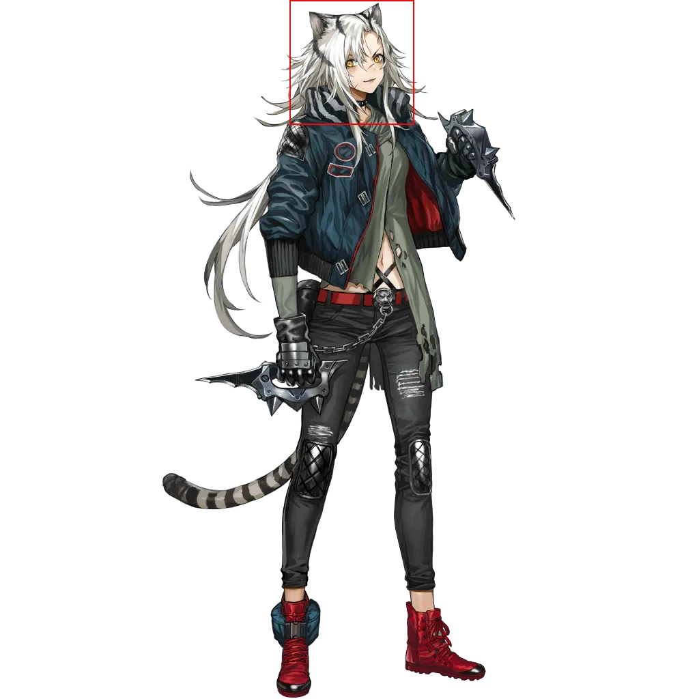

 # Page 1

[返回](../README.md)

| 全图 | 头像 | 模式 | 结果 |
| --- | --- | --- | --- |
|  |  | 模板 | `[375, 21, 559, 205]` |
|  |  | 模板 | `[385, 0, 587, 202]` |
|  |  | 模板 | `[404, 0, 599, 195]` |
|  |  | 模板 | `[399, 0, 601, 202]` |
|  |  | 模板 | `[453, 7, 663, 217]` |
|  |  | 模板 | `[378, 0, 585, 207]` |
|  |  | 模板 | `[435, 17, 647, 229]` |
|  |  | 模板 | `[457, 163, 633, 339]` |
|  |  | 模板 | `[435, 6, 582, 153]` |
|  |  | 模板 | `[400, 84, 584, 268]` |
|  |  | 识别 | `[510, 62, 636, 188]` |
|  |  | 模板 | `[404, 87, 553, 236]` |
|  |  | 模板 | `[479, 89, 661, 271]` |
|  |  | 模板 | `[521, 66, 703, 248]` |
|  |  | 模板 | `[376, 51, 593, 268]` |
|  |  | 模板 | `[764, 440, 894, 570]` |
|  |  | 模板 | `[488, 1, 699, 212]` |
|  |  | 模板 | `[409, 64, 566, 221]` |
|  |  | 模板 | `[308, 0, 473, 165]` |
|  |  | 模板 | `[417, 2, 629, 214]` |
|  |  | 模板 | `[426, 0, 608, 182]` |
|  |  | 模板 | `[415, 0, 611, 196]` |
|  |  | 模板 | `[508, 59, 690, 241]` |
|  |  | 模板 | `[445, 23, 627, 205]` |
|  |  | 模板 | `[382, 4, 560, 182]` |
|  |  | 模板 | `[456, 49, 638, 231]` |
|  |  | 模板 | `[406, 27, 614, 235]` |
|  |  | 模板 | `[418, 39, 601, 222]` |
|  |  | 模板 | `[382, 23, 595, 236]` |
|  |  | 模板 | `[400, 0, 603, 203]` |
|  |  | 模板 | `[430, 27, 604, 201]` |
|  |  | 模板 | `[370, 0, 595, 225]` |
|  |  | 模板 | `[381, 0, 575, 194]` |
|  |  | 模板 | `[426, 0, 663, 237]` |
|  |  | 模板 | `[388, 1, 606, 219]` |
|  |  | 模板 | `[479, 46, 665, 232]` |
|  |  | 模板 | `[428, 49, 604, 225]` |
|  |  | 模板 | `[271, 86, 505, 320]` |
|  |  | 模板 | `[503, 0, 693, 190]` |
|  |  | 模板 | `[436, 0, 632, 196]` |
|  |  | 模板 | `[270, 7, 504, 241]` |
|  |  | 模板 | `[366, 0, 564, 198]` |
|  |  | 模板 | `[419, 16, 628, 225]` |
|  |  | 模板 | `[415, 0, 599, 184]` |
|  |  | 模板 | `[427, 10, 677, 260]` |
|  |  | 模板 | `[380, 0, 562, 182]` |
|  |  | 模板 | `[485, 0, 661, 176]` |
|  |  | 模板 | `[425, 179, 615, 369]` |
|  |  | 模板 | `[424, 0, 606, 182]` |
|  |  | 模板 | `[356, 10, 529, 183]` |
|  |  | 模板 | `[520, 0, 715, 195]` |
|  |  | 模板 | `[535, 0, 728, 193]` |
|  |  | 模板 | `[462, 4, 644, 186]` |
|  |  | 模板 | `[409, 97, 586, 274]` |
|  |  | 模板 | `[464, 19, 661, 216]` |
|  |  | 模板 | `[419, 133, 601, 315]` |
|  |  | 模板 | `[399, 0, 615, 216]` |
|  |  | 模板 | `[486, 29, 715, 258]` |
|  |  | 模板 | `[487, 71, 685, 269]` |
|  |  | 模板 | `[408, 0, 615, 207]` |
|  |  | 模板 | `[356, 23, 602, 269]` |
|  |  | 模板 | `[406, 141, 576, 311]` |
|  |  | 模板 | `[349, 0, 569, 220]` |
|  |  | 模板 | `[421, 0, 599, 178]` |
|  |  | 模板 | `[448, 0, 630, 182]` |
|  |  | 模板 | `[417, 37, 599, 219]` |
|  |  | 模板 | `[432, 203, 616, 387]` |
|  |  | 模板 | `[405, 0, 618, 213]` |
|  |  | 模板 | `[430, 19, 607, 196]` |
|  |  | 模板 | `[452, 13, 634, 195]` |
|  |  | 模板 | `[436, 47, 606, 217]` |
|  |  | 模板 | `[448, 0, 624, 176]` |
|  |  | 模板 | `[426, 0, 576, 150]` |
|  |  | 模板 | `[329, 145, 476, 292]` |
|  |  | 模板 | `[448, 24, 657, 233]` |
|  |  | 模板 | `[410, 37, 605, 232]` |
|  |  | 模板 | `[394, 114, 593, 313]` |
|  |  | 模板 | `[371, 0, 553, 182]` |
|  |  | 模板 | `[434, 35, 652, 253]` |
|  |  | 模板 | `[449, 157, 631, 339]` |
|  |  | 模板 | `[443, 0, 666, 223]` |
|  |  | 模板 | `[354, 0, 536, 182]` |
|  |  | 模板 | `[337, 132, 519, 314]` |
|  |  | 模板 | `[379, 106, 571, 298]` |
|  |  | 模板 | `[392, 0, 593, 201]` |
|  |  | 模板 | `[432, 0, 643, 211]` |
|  |  | 模板 | `[445, 66, 639, 260]` |
|  |  | 模板 | `[432, 7, 638, 213]` |
|  |  | 模板 | `[476, 31, 659, 214]` |
|  |  | 模板 | `[389, 0, 551, 162]` |
|  |  | 模板 | `[423, 0, 612, 189]` |
|  |  | 模板 | `[391, 0, 568, 177]` |
|  |  | 模板 | `[374, 1, 597, 224]` |
|  |  | 模板 | `[395, 34, 650, 289]` |
|  |  | 模板 | `[403, 3, 637, 237]` |
|  |  | 模板 | `[425, 0, 558, 133]` |
|  |  | 模板 | `[416, 0, 618, 202]` |
|  |  | 模板 | `[423, 40, 602, 219]` |
|  |  | 模板 | `[437, 33, 641, 237]` |
|  |  | 模板 | `[379, 114, 614, 349]` |