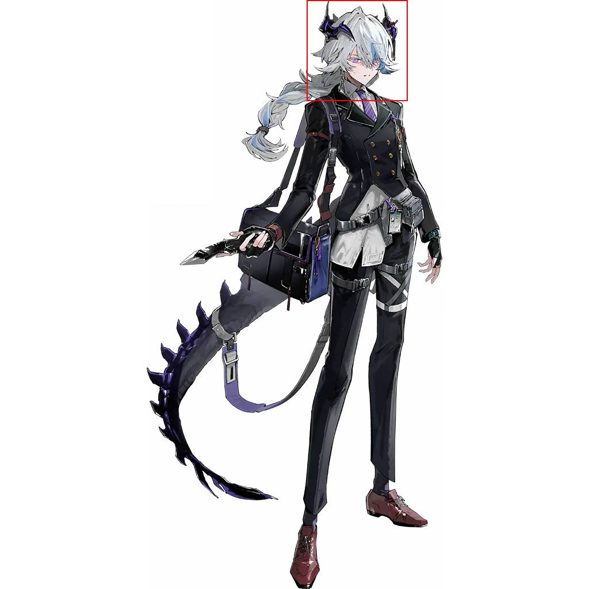
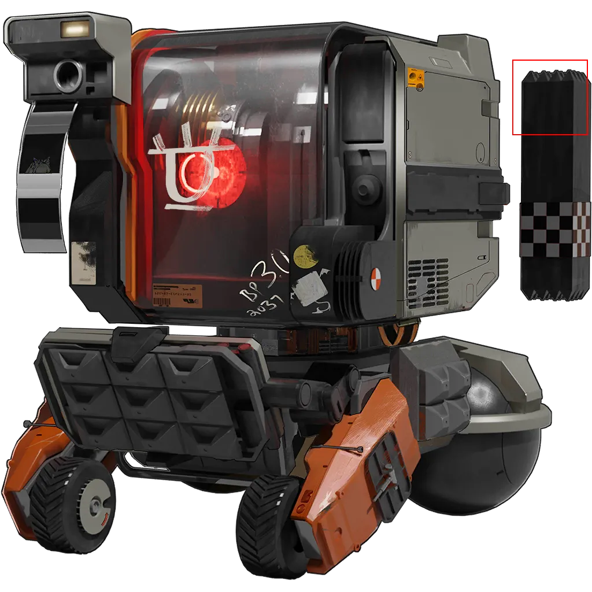

 # Page 2

[返回](../README.md)

| 全图 | 头像 | 模式 | 结果 |
| --- | --- | --- | --- |
|  |  | 模板 | `[625, 137, 765, 277]` |
|  |  | 模板 | `[369, 0, 573, 204]` |
|  |  | 模板 | `[358, 123, 567, 332]` |
|  |  | 模板 | `[404, 27, 600, 223]` |
|  |  | 模板 | `[441, 100, 614, 273]` |
|  |  | 模板 | `[452, 2, 635, 185]` |
|  |  | 模板 | `[398, 9, 620, 231]` |
|  |  | 模板 | `[443, 165, 625, 347]` |
|  |  | 模板 | `[483, 0, 738, 255]` |
|  |  | 模板 | `[395, 0, 585, 190]` |
|  |  | 模板 | `[439, 123, 621, 305]` |
|  |  | 模板 | `[386, 135, 564, 313]` |
|  |  | 模板 | `[320, 1, 504, 185]` |
|  |  | 模板 | `[368, 0, 568, 200]` |
|  |  | 模板 | `[365, 8, 533, 176]` |
|  |  | 模板 | `[424, 0, 606, 182]` |
|  |  | 模板 | `[619, 605, 749, 735]` |
|  |  | 模板 | `[500, 116, 698, 314]` |
|  |  | 模板 | `[385, 75, 613, 303]` |
|  |  | 模板 | `[444, 0, 728, 284]` |
|  |  | 模板 | `[439, 96, 647, 304]` |
|  |  | 模板 | `[352, 0, 550, 198]` |
|  |  | 模板 | `[397, 81, 554, 238]` |
|  |  | 模板 | `[382, 0, 589, 207]` |
|  |  | 模板 | `[536, 228, 666, 358]` |
|  |  | 模板 | `[410, 0, 604, 194]` |
|  |  | 模板 | `[495, 278, 632, 415]` |
|  |  | 模板 | `[195, 682, 378, 865]` |
|  |  | 模板 | `[428, 89, 643, 304]` |
|  |  | 模板 | `[558, 0, 736, 178]` |
|  |  | 模板 | `[478, 0, 674, 196]` |
|  |  | 模板 | `[488, 56, 691, 259]` |
|  |  | 模板 | `[505, 62, 687, 244]` |
|  |  | 模板 | `[395, 223, 577, 405]` |
|  |  | 模板 | `[679, 26, 899, 246]` |
|  |  | 模板 | `[413, 0, 622, 209]` |
|  |  | 模板 | `[533, 0, 708, 175]` |
|  |  | 模板 | `[353, 108, 530, 285]` |
|  |  | 模板 | `[420, 0, 602, 182]` |
|  |  | 模板 | `[393, 0, 616, 223]` |
|  |  | 模板 | `[468, 31, 661, 224]` |
|  |  | 模板 | `[393, 35, 575, 217]` |
|  |  | 模板 | `[433, 0, 615, 182]` |
|  |  | 模板 | `[396, 42, 575, 221]` |
|  |  | 模板 | `[462, 125, 652, 315]` |
|  |  | 模板 | `[514, 0, 696, 182]` |
|  |  | 模板 | `[417, 106, 618, 307]` |
|  |  | 模板 | `[424, 71, 606, 253]` |
|  |  | 模板 | `[403, 53, 585, 235]` |
|  |  | 模板 | `[498, 68, 680, 250]` |
|  |  | 模板 | `[365, 43, 560, 238]` |
|  |  | 模板 | `[435, 0, 617, 182]` |
|  |  | 模板 | `[489, 16, 671, 198]` |
|  |  | 模板 | `[444, 0, 589, 145]` |
|  |  | 模板 | `[414, 18, 605, 209]` |
|  |  | 模板 | `[436, 2, 618, 184]` |
|  |  | 模板 | `[419, 0, 601, 182]` |
|  |  | 模板 | `[521, 69, 705, 253]` |
|  |  | 模板 | `[374, 0, 563, 189]` |
|  |  | 模板 | `[448, 7, 622, 181]` |
|  |  | 模板 | `[525, 33, 709, 217]` |
|  |  | 模板 | `[263, 0, 445, 182]` |
|  |  | 模板 | `[405, 92, 619, 306]` |
|  |  | 模板 | `[751, 469, 885, 603]` |
|  |  | 模板 | `[414, 0, 598, 184]` |
|  |  | 模板 | `[276, 0, 430, 154]` |
|  |  | 模板 | `[513, 186, 643, 316]` |
|  |  | 模板 | `[373, 82, 603, 312]` |
|  |  | 模板 | `[886, 103, 1016, 233]` |
|  |  | 模板 | `[491, 166, 625, 300]` |
|  |  | 模板 | `[455, 66, 640, 251]` |
|  |  | 模板 | `[443, 0, 670, 227]` |
|  |  | 模板 | `[426, 0, 608, 182]` |
|  |  | 模板 | `[362, 13, 557, 208]` |
|  |  | 模板 | `[387, 1, 580, 194]` |
|  |  | 模板 | `[392, 27, 574, 209]` |
|  |  | 模板 | `[419, 41, 601, 223]` |
|  |  | 模板 | `[438, 43, 615, 220]` |
|  |  | 模板 | `[428, 0, 610, 182]` |
|  |  | 模板 | `[397, 0, 579, 182]` |
|  |  | 模板 | `[375, 37, 567, 229]` |
|  |  | 模板 | `[498, 0, 680, 182]` |
|  |  | 模板 | `[494, 94, 676, 276]` |
|  |  | 模板 | `[308, 0, 495, 187]` |
|  |  | 模板 | `[413, 12, 606, 205]` |
|  |  | 模板 | `[430, 56, 609, 235]` |
|  |  | 模板 | `[466, 48, 648, 230]` |
|  |  | 模板 | `[450, 63, 629, 242]` |
|  |  | 模板 | `[406, 0, 597, 191]` |
|  |  | 模板 | `[414, 0, 603, 189]` |
|  |  | 模板 | `[445, 0, 608, 163]` |
|  |  | 模板 | `[406, 102, 588, 284]` |
|  |  | 模板 | `[409, 0, 644, 235]` |
|  |  | 模板 | `[313, 0, 551, 238]` |
|  |  | 模板 | `[405, 9, 628, 232]` |
|  |  | 模板 | `[323, 94, 509, 280]` |
|  |  | 模板 | `[416, 101, 587, 272]` |
|  |  | 模板 | `[413, 71, 610, 268]` |
|  |  | 模板 | `[440, 57, 570, 187]` |
|  |  | 模板 | `[346, 51, 535, 240]` |