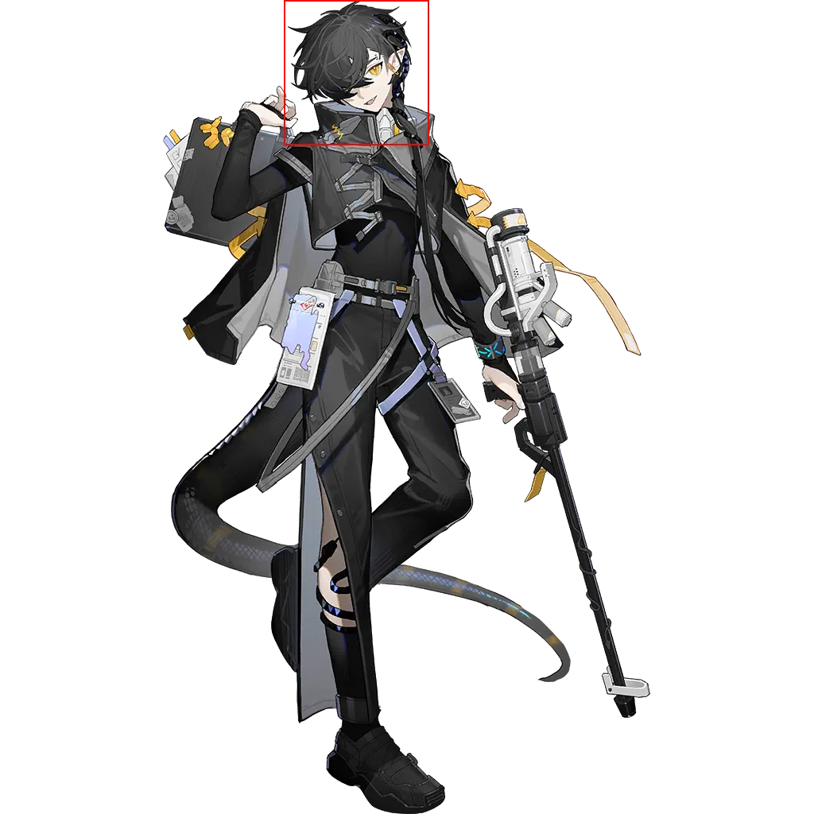
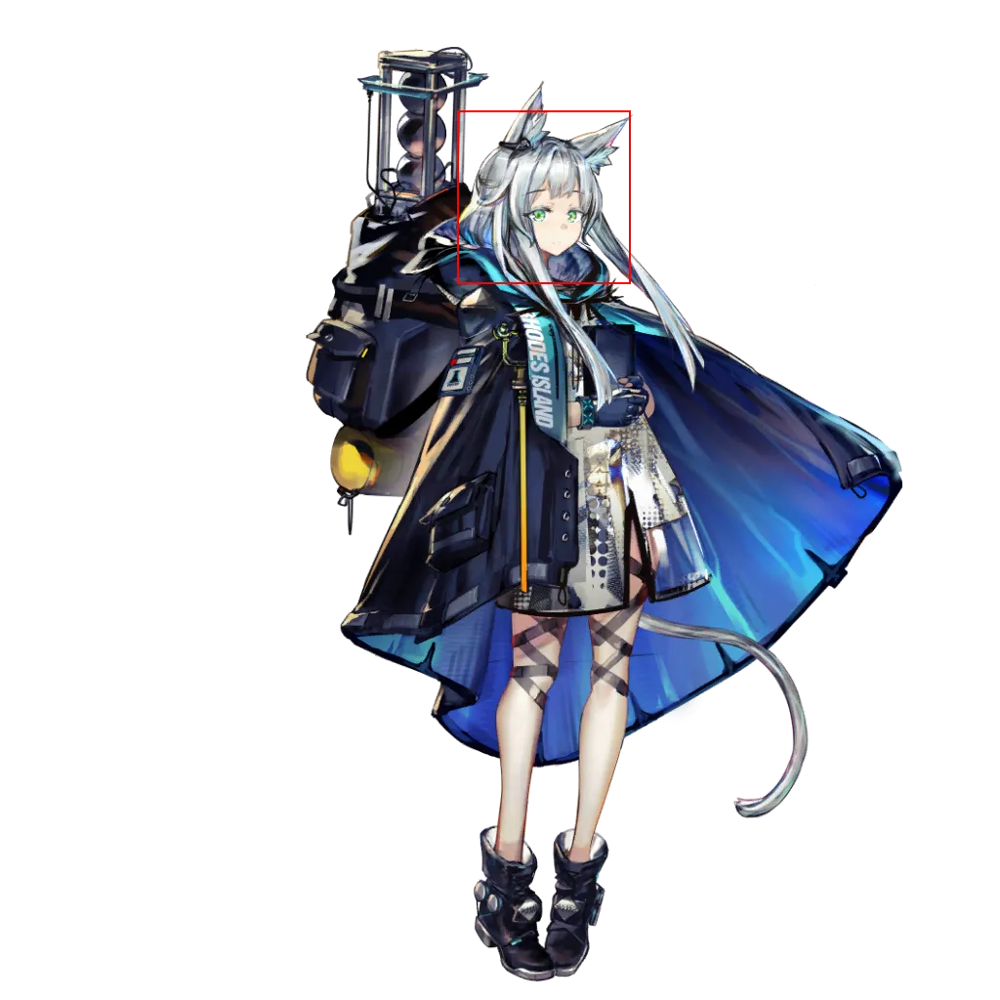

 # Page 3

[返回](../README.md)

| 全图 | 头像 | 模式 | 结果 |
| --- | --- | --- | --- |
|  |  | 模板 | `[426, 0, 609, 183]` |
|  |  | 模板 | `[404, 77, 593, 266]` |
|  |  | 模板 | `[430, 157, 612, 339]` |
|  |  | 模板 | `[363, 129, 545, 311]` |
|  |  | 模板 | `[420, 0, 602, 182]` |
|  |  | 模板 | `[421, 50, 603, 232]` |
|  |  | 模板 | `[357, 0, 539, 182]` |
|  |  | 模板 | `[432, 100, 579, 247]` |
|  |  | 模板 | `[421, 65, 595, 239]` |
|  |  | 模板 | `[491, 0, 673, 182]` |
|  |  | 模板 | `[473, 11, 673, 211]` |
|  |  | 模板 | `[438, 139, 605, 306]` |
|  |  | 模板 | `[476, 0, 664, 188]` |
|  |  | 模板 | `[408, 116, 541, 249]` |
|  |  | 模板 | `[457, 76, 639, 258]` |
|  |  | 模板 | `[400, 510, 530, 640]` |
|  |  | 模板 | `[448, 0, 676, 228]` |
|  |  | 识别 | `[434, 69, 520, 155]` |
|  |  | 识别 | `[434, 68, 521, 155]` |
|  |  | 识别 | `[440, 193, 527, 280]` |
|  |  | 识别 | `[434, 186, 534, 286]` |
|  |  | 模板 | `[425, 39, 622, 236]` |
|  |  | 识别 | `[430, 79, 535, 184]` |
|  |  | 识别 | `[438, 104, 538, 204]` |
|  |  | 识别 | `[445, 185, 547, 287]` |
|  |  | 识别 | `[459, 86, 544, 171]` |
|  |  | 识别 | `[411, 95, 487, 171]` |
|  |  | 识别 | `[395, 89, 510, 204]` |
|  |  | 模板 | `[785, 398, 996, 609]` |
|  |  | 识别 | `[426, 112, 515, 201]` |
|  |  | 模板 | `[462, 99, 659, 296]` |
|  |  | 模板 | `[468, 113, 645, 290]` |
|  |  | 识别 | `[599, 119, 697, 217]` |
|  |  | 模板 | `[540, 312, 671, 443]` |
|  |  | 识别 | `[416, 118, 542, 244]` |
|  |  | 识别 | `[441, 194, 550, 303]` |
|  |  | 模板 | `[395, 7, 594, 206]` |
|  |  | 模板 | `[421, 13, 585, 177]` |
|  |  | 模板 | `[421, 44, 603, 226]` |
|  |  | 识别 | `[459, 90, 579, 210]` |
|  |  | 模板 | `[381, 140, 590, 349]` |
|  |  | 模板 | `[431, 6, 618, 193]` |
|  |  | 识别 | `[476, 114, 567, 205]` |
|  |  | 识别 | `[489, 163, 545, 219]` |
|  |  | 模板 | `[378, 100, 554, 276]` |
|  |  | 识别 | `[496, 100, 571, 175]` |
|  |  | 识别 | `[457, 122, 562, 227]` |
|  |  | 识别 | `[433, 127, 539, 233]` |
|  |  | 识别 | `[421, 137, 526, 242]` |
|  |  | 识别 | `[466, 134, 566, 234]` |
|  |  | 识别 | `[447, 152, 546, 251]` |
|  |  | 识别 | `[472, 144, 579, 251]` |
|  |  | 识别 | `[449, 76, 555, 182]` |
|  |  | 识别 | `[459, 99, 572, 212]` |
|  |  | 识别 | `[467, 85, 581, 199]` |
|  |  | 识别 | `[444, 229, 537, 322]` |
|  |  | 模板 | `[445, 47, 627, 229]` |
|  |  | 模板 | `[416, 154, 598, 336]` |
|  |  | 识别 | `[358, 108, 474, 224]` |
|  |  | 识别 | `[406, 85, 496, 175]` |
|  |  | 模板 | `[413, 39, 603, 229]` |
|  |  | 模板 | `[210, 839, 395, 1024]` |
|  |  | 识别 | `[394, 47, 499, 152]` |
|  |  | 识别 | `[447, 39, 575, 167]` |
|  |  | 识别 | `[408, 87, 543, 222]` |
|  |  | 识别 | `[504, 88, 631, 215]` |
|  |  | 识别 | `[413, 83, 540, 210]` |
|  |  | 识别 | `[488, 53, 603, 168]` |
|  |  | 识别 | `[475, 150, 565, 240]` |
|  |  | 识别 | `[415, 55, 516, 156]` |
|  |  | 识别 | `[375, 51, 486, 162]` |
|  |  | 识别 | `[480, 109, 562, 191]` |
|  |  | 识别 | `[526, 86, 607, 167]` |
|  |  | 识别 | `[414, 93, 501, 180]` |
|  |  | 模板 | `[422, 33, 604, 215]` |
|  |  | 识别 | `[472, 101, 554, 183]` |
|  |  | 识别 | `[476, 90, 593, 207]` |
|  |  | 识别 | `[380, 99, 495, 214]` |
|  |  | 识别 | `[463, 203, 554, 294]` |
|  |  | 识别 | `[467, 78, 573, 184]` |
|  |  | 识别 | `[494, 51, 593, 150]` |
|  |  | 识别 | `[450, 92, 555, 197]` |
|  |  | 识别 | `[480, 83, 577, 180]` |
|  |  | 识别 | `[479, 87, 576, 184]` |
|  |  | 识别 | `[470, 92, 556, 178]` |
|  |  | 识别 | `[441, 109, 553, 221]` |
|  |  | 识别 | `[489, 52, 599, 162]` |
|  |  | 识别 | `[443, 41, 561, 159]` |
|  |  | 识别 | `[446, 59, 552, 165]` |
|  |  | 识别 | `[416, 212, 543, 339]` |
|  |  | 识别 | `[536, 140, 624, 228]` |
|  |  | 识别 | `[757, 316, 793, 352]` |
|  |  | 识别 | `[474, 71, 595, 192]` |
|  |  | 识别 | `[492, 122, 582, 212]` |
|  |  | 识别 | `[460, 83, 556, 179]` |
|  |  | 识别 | `[511, 35, 623, 147]` |
|  |  | 识别 | `[462, 51, 567, 156]` |
|  |  | 识别 | `[475, 48, 603, 176]` |
|  |  | 识别 | `[453, 67, 549, 163]` |
|  |  | 识别 | `[448, 35, 574, 161]` |