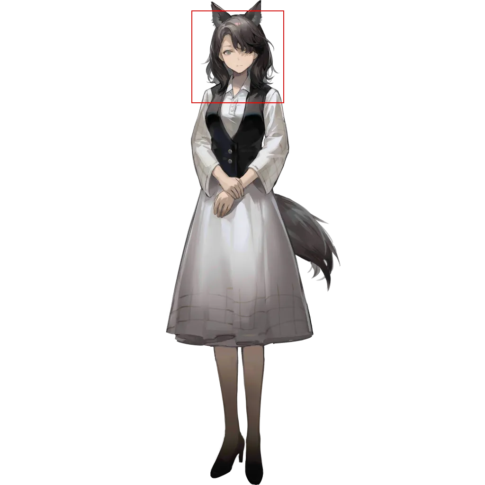

 # Page 5

[返回](../README.md)

| 全图 | 头像 | 模式 | 结果 |
| --- | --- | --- | --- |
|  |  | 识别 | `[454, 144, 557, 247]` |
|  |  | 识别 | `[494, 102, 584, 192]` |
|  |  | 识别 | `[447, 116, 540, 209]` |
|  |  | 识别 | `[489, 106, 585, 202]` |
|  |  | 识别 | `[443, 112, 542, 211]` |
|  |  | 识别 | `[544, 227, 609, 292]` |
|  |  | 识别 | `[480, 45, 595, 160]` |
|  |  | 识别 | `[444, 141, 544, 241]` |
|  |  | 识别 | `[424, 48, 506, 130]` |
|  |  | 识别 | `[474, 114, 654, 294]` |
|  |  | 识别 | `[474, 110, 662, 298]` |
|  |  | 识别 | `[482, 68, 614, 200]` |
|  |  | 识别 | `[456, 40, 603, 187]` |
|  |  | 识别 | `[463, 42, 604, 183]` |
|  |  | 识别 | `[469, 112, 587, 230]` |
|  |  | 识别 | `[402, 85, 576, 259]` |
|  |  | 识别 | `[460, 41, 552, 133]` |
|  |  | 识别 | `[448, 68, 542, 162]` |
|  |  | 识别 | `[473, 96, 560, 183]` |
|  |  | 识别 | `[443, 75, 528, 160]` |
|  |  | 识别 | `[432, 77, 574, 219]` |
|  |  | 识别 | `[442, 46, 565, 169]` |
|  |  | 识别 | `[462, 69, 562, 169]` |
|  |  | 识别 | `[400, 72, 528, 200]` |
|  |  | 识别 | `[402, 88, 513, 199]` |
|  |  | 识别 | `[461, 42, 567, 148]` |
|  |  | 识别 | `[439, 70, 552, 183]` |
|  |  | 识别 | `[469, 54, 582, 167]` |
|  |  | 识别 | `[464, 51, 563, 150]` |
|  |  | 识别 | `[435, 147, 513, 225]` |
|  |  | 识别 | `[444, 62, 559, 177]` |
|  |  | 识别 | `[401, 84, 532, 215]` |
|  |  | 识别 | `[425, 64, 539, 178]` |
|  |  | 识别 | `[436, 33, 566, 163]` |
|  |  | 识别 | `[490, 45, 595, 150]` |
|  |  | 识别 | `[490, 42, 602, 154]` |
|  |  | 识别 | `[590, 121, 681, 212]` |
|  |  | 识别 | `[451, 67, 548, 164]` |
|  |  | 识别 | `[386, 96, 494, 204]` |
|  |  | 识别 | `[425, 53, 518, 146]` |
|  |  | 识别 | `[442, 47, 527, 132]` |
|  |  | 识别 | `[456, 37, 579, 160]` |
|  |  | 识别 | `[530, 66, 633, 169]` |
|  |  | 识别 | `[444, 197, 543, 296]` |
|  |  | 识别 | `[458, 68, 586, 196]` |
|  |  | 识别 | `[436, 75, 563, 202]` |
|  |  | 识别 | `[505, 76, 610, 181]` |
|  |  | 识别 | `[433, 45, 555, 167]` |
|  |  | 识别 | `[424, 74, 558, 208]` |
|  |  | 识别 | `[414, 128, 624, 338]` |
|  |  | 识别 | `[442, 137, 651, 346]` |
|  |  | 识别 | `[167, 120, 221, 174]` |
|  |  | 识别 | `[513, 88, 609, 184]` |
|  |  | 识别 | `[494, 80, 603, 189]` |
|  |  | 识别 | `[453, 132, 554, 233]` |
|  |  | 识别 | `[423, 66, 537, 180]` |
|  |  | 识别 | `[452, 63, 572, 183]` |
|  |  | 识别 | `[458, 52, 625, 219]` |
|  |  | 识别 | `[459, 58, 609, 208]` |
|  |  | 识别 | `[512, 69, 632, 189]` |
|  |  | 识别 | `[506, 92, 678, 264]` |
|  |  | 识别 | `[447, 88, 599, 240]` |
|  |  | 识别 | `[455, 33, 578, 156]` |
|  |  | 模板 | `[418, 152, 600, 334]` |
|  |  | 模板 | `[404, 74, 616, 286]` |
|  |  | 模板 | `[466, 567, 596, 697]` |
|  |  | 模板 | `[455, 42, 585, 172]` |
|  |  | 模板 | `[419, 60, 557, 198]` |
|  |  | 模板 | `[401, 45, 583, 227]` |
|  |  | 识别 | `[464, 97, 577, 210]` |
|  |  | 模板 | `[408, 47, 590, 229]` |
|  |  | 模板 | `[460, 59, 642, 241]` |
|  |  | 模板 | `[421, 38, 612, 229]` |
|  |  | 识别 | `[453, 170, 547, 264]` |
|  |  | 识别 | `[482, 142, 584, 244]` |
|  |  | 模板 | `[408, 70, 590, 252]` |
|  |  | 模板 | `[414, 5, 572, 163]` |
|  |  | 识别 | `[472, 70, 578, 176]` |
|  |  | 模板 | `[428, 65, 610, 247]` |
|  |  | 模板 | `[291, 400, 715, 824]` |
|  |  | 模板 | `[429, 52, 622, 245]` |
|  |  | 模板 | `[416, 39, 611, 234]` |
|  |  | 模板 | `[419, 26, 621, 228]` |
|  |  | 模板 | `[409, 36, 611, 238]` |
|  |  | 模板 | `[380, 52, 562, 234]` |
|  |  | 模板 | `[420, 32, 628, 240]` |
|  |  | 模板 | `[433, 17, 636, 220]` |
|  |  | 模板 | `[416, 40, 598, 222]` |
|  |  | 模板 | `[384, 32, 566, 214]` |
|  |  | 模板 | `[391, 0, 599, 208]` |
|  |  | 模板 | `[387, 17, 623, 253]` |
|  |  | 模板 | `[353, 131, 528, 306]` |
|  |  | 模板 | `[371, 34, 568, 231]` |
|  |  | 模板 | `[357, 23, 564, 230]` |
|  |  | 模板 | `[356, 54, 593, 291]` |
|  |  | 模板 | `[399, 23, 609, 233]` |
|  |  | 模板 | `[353, 89, 539, 275]` |
|  |  | 模板 | `[478, 33, 660, 215]` |
|  |  | 模板 | `[443, 44, 627, 228]` |
|  |  | 模板 | `[389, 53, 571, 235]` |