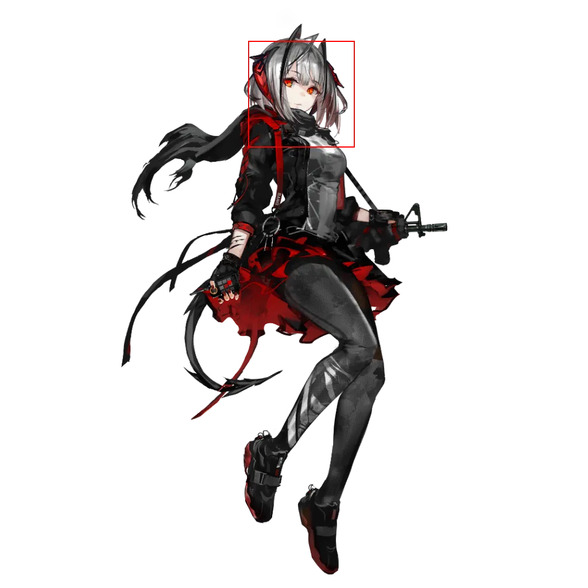
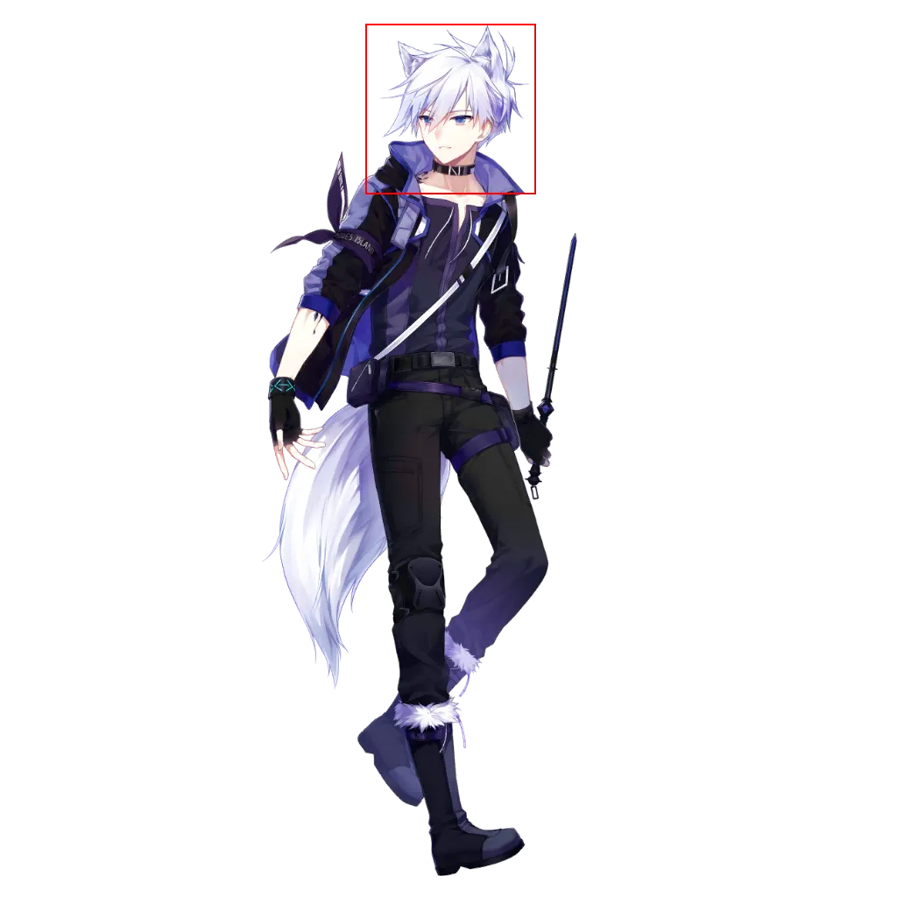
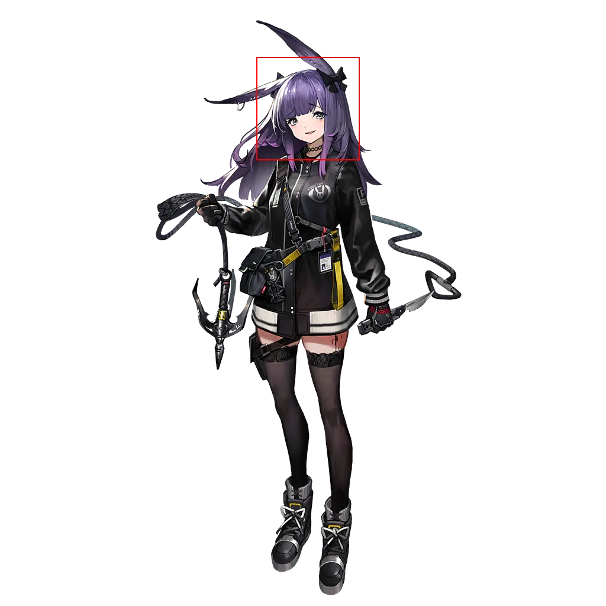

 # Page 6

[返回](../README.md)

| 全图 | 头像 | 模式 | 结果 |
| --- | --- | --- | --- |
|  |  | 模板 | `[330, 25, 552, 247]` |
|  |  | 模板 | `[370, 7, 582, 219]` |
|  |  | 模板 | `[404, 40, 586, 222]` |
|  |  | 模板 | `[460, 41, 642, 223]` |
|  |  | 模板 | `[403, 136, 585, 318]` |
|  |  | 模板 | `[405, 0, 598, 193]` |
|  |  | 模板 | `[418, 9, 607, 198]` |
|  |  | 模板 | `[405, 4, 657, 256]` |
|  |  | 模板 | `[479, 72, 656, 249]` |
|  |  | 模板 | `[422, 36, 604, 218]` |
|  |  | 模板 | `[417, 71, 591, 245]` |
|  |  | 模板 | `[384, 53, 566, 235]` |
|  |  | 模板 | `[401, 94, 583, 276]` |
|  |  | 模板 | `[401, 94, 583, 276]` |
|  |  | 识别 | `[472, 111, 577, 216]` |
|  |  | 识别 | `[524, 189, 610, 275]` |
|  |  | 识别 | `[446, 136, 562, 252]` |
|  |  | 模板 | `[502, 0, 733, 231]` |
|  |  | 模板 | `[425, 226, 607, 408]` |
|  |  | 模板 | `[369, 11, 560, 202]` |
|  |  | 模板 | `[449, 0, 608, 159]` |
|  |  | 模板 | `[396, 73, 603, 280]` |
|  |  | 模板 | `[376, 48, 558, 230]` |
|  |  | 模板 | `[494, 35, 682, 223]` |
|  |  | 模板 | `[430, 21, 624, 215]` |
|  |  | 模板 | `[420, 29, 602, 211]` |
|  |  | 模板 | `[417, 109, 599, 291]` |
|  |  | 模板 | `[395, 49, 600, 254]` |
|  |  | 模板 | `[395, 50, 599, 254]` |
|  |  | 模板 | `[488, 94, 699, 305]` |
|  |  | 模板 | `[444, 108, 620, 284]` |
|  |  | 模板 | `[385, 3, 601, 219]` |
|  |  | 模板 | `[419, 33, 625, 239]` |
|  |  | 模板 | `[403, 4, 602, 203]` |
|  |  | 模板 | `[443, 0, 625, 182]` |
|  |  | 模板 | `[359, 47, 574, 262]` |
|  |  | 模板 | `[412, 0, 602, 190]` |
|  |  | 模板 | `[366, 4, 594, 232]` |
|  |  | 模板 | `[345, 22, 566, 243]` |
|  |  | 模板 | `[488, 2, 719, 233]` |
|  |  | 模板 | `[423, 27, 605, 209]` |
|  |  | 模板 | `[394, 10, 576, 192]` |
|  |  | 模板 | `[441, 37, 623, 219]` |
|  |  | 识别 | `[459, 188, 550, 279]` |
|  |  | 模板 | `[420, 70, 616, 266]` |
|  |  | 模板 | `[440, 29, 639, 228]` |
|  |  | 模板 | `[417, 38, 600, 221]` |
|  |  | 模板 | `[384, 19, 605, 240]` |
|  |  | 模板 | `[416, 9, 552, 145]` |
|  |  | 识别 | `[453, 102, 566, 215]` |
|  |  | 模板 | `[427, 98, 609, 280]` |
|  |  | 模板 | `[391, 65, 581, 255]` |
|  |  | 模板 | `[397, 58, 600, 261]` |
|  |  | 模板 | `[417, 27, 611, 221]` |
|  |  | 模板 | `[437, 50, 629, 242]` |
|  |  | 模板 | `[392, 22, 581, 211]` |
|  |  | 模板 | `[427, 33, 630, 236]` |
|  |  | 模板 | `[431, 58, 615, 242]` |
|  |  | 模板 | `[462, 86, 644, 268]` |
|  |  | 模板 | `[420, 145, 602, 327]` |
|  |  | 模板 | `[439, 149, 608, 318]` |
|  |  | 模板 | `[391, 27, 602, 238]` |
|  |  | 模板 | `[406, 33, 578, 205]` |
|  |  | 模板 | `[428, 122, 603, 297]` |
|  |  | 模板 | `[433, 96, 607, 270]` |
|  |  | 模板 | `[410, 40, 596, 226]` |
|  |  | 模板 | `[412, 5, 591, 184]` |
|  |  | 模板 | `[437, 85, 627, 275]` |
|  |  | 模板 | `[400, 23, 598, 221]` |
|  |  | 模板 | `[384, 21, 566, 203]` |
|  |  | 模板 | `[428, 18, 616, 206]` |
|  |  | 模板 | `[421, 8, 603, 190]` |
|  |  | 模板 | `[396, 0, 579, 183]` |
|  |  | 模板 | `[336, 52, 543, 259]` |
|  |  | 模板 | `[388, 79, 613, 304]` |
|  |  | 模板 | `[400, 7, 628, 235]` |
|  |  | 识别 | `[448, 108, 557, 217]` |
|  |  | 模板 | `[366, 62, 559, 255]` |
|  |  | 模板 | `[420, 25, 602, 207]` |
|  |  | 模板 | `[426, 8, 579, 161]` |
|  |  | 模板 | `[407, 78, 589, 260]` |
|  |  | 模板 | `[414, 26, 618, 230]` |
|  |  | 模板 | `[382, 39, 564, 221]` |
|  |  | 模板 | `[403, 10, 585, 192]` |
|  |  | 模板 | `[336, 64, 571, 299]` |
|  |  | 模板 | `[394, 43, 576, 225]` |
|  |  | 模板 | `[412, 14, 594, 196]` |
|  |  | 模板 | `[355, 27, 571, 243]` |
|  |  | 模板 | `[306, 283, 494, 471]` |
|  |  | 模板 | `[382, 83, 581, 282]` |
|  |  | 模板 | `[380, 48, 583, 251]` |
|  |  | 模板 | `[416, 0, 588, 172]` |
|  |  | 模板 | `[431, 33, 602, 204]` |
|  |  | 模板 | `[371, 16, 565, 210]` |
|  |  | 模板 | `[390, 43, 581, 234]` |
|  |  | 模板 | `[360, 49, 556, 245]` |
|  |  | 模板 | `[407, 74, 583, 250]` |
|  |  | 模板 | `[398, 61, 583, 246]` |
|  |  | 模板 | `[435, 94, 617, 276]` |
|  |  | 模板 | `[384, 30, 596, 242]` |